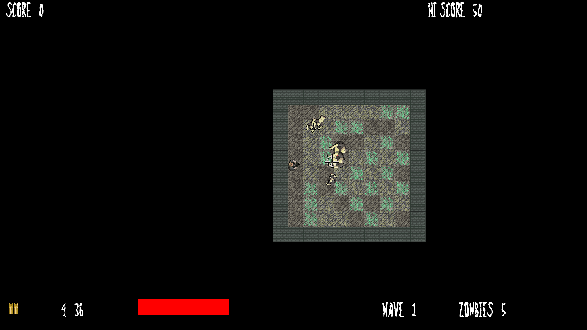
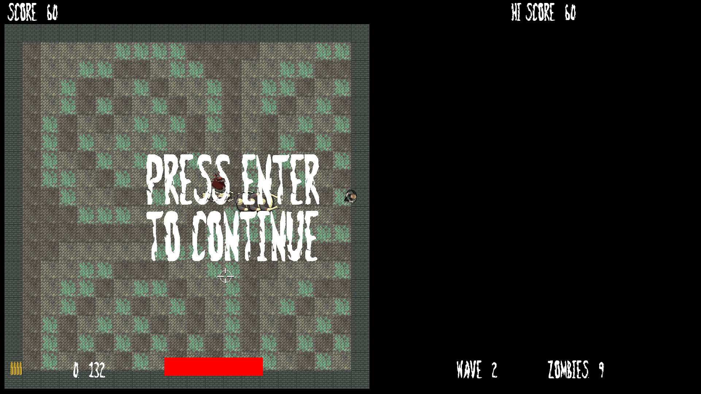
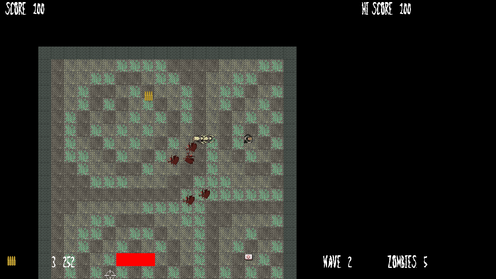
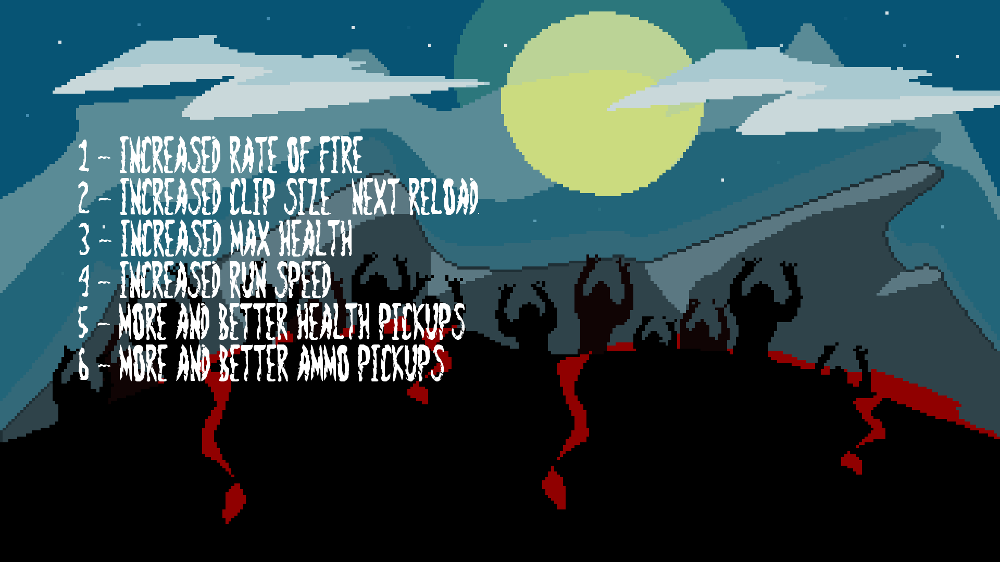

# Zombie Arena
Survive as many waves of Zombies as possible by shooting them down. Be carefull not to be touched by them or else you are gonna become a zombie yourself!

## Requirements
- C++
- SFML (x32 version)

## Install Game
- Using the terminal, navigate to a local directory that you want to clone this game directory into.
- Clone the repository by following these instructions [instruction](https://help.github.com/en/github/creating-cloning-and-archiving-repositories/cloning-a-repository).

### building in Visual Studio
First and foremost you have to install the [SFML graphics library](https://www.sfml-dev.org/). 

Detailed steps can be found [here](https://www.sfml-dev.org/tutorials/2.5/#getting-started).

After opening the project, go to **"Project -> Properties..."**:
- Select **"All configurations"** in **"Configuration"** section;
- In **"C/C++ -> General -> Additional include directories"** section append the "include" directory of SFML library;
- In **"Linker -> General -> Additional library directories"** section append the "lib" directory of SFML library;
- Select **Debug** in **Configuration** section;
- At the beginning of the **"Linker -> Input -> Additional dependencies"** section append the string:
```bash
sfml-graphics-d.lib;sfml-window-d.lib;sfml-system-d.lib;sfml-network-d.lib;sfml-audio-d.lib;
```

## HotKeys
- `Enter` Start or pause the game.
- Movement `W`, `A`, `S`, `D`.
- Look around using mouse.
- Left mouse button for shooting.
- Collect items (Health, Ammo) by walking over them. Level up.
- `R` Reload weapon.
- `Num1` / `Num2` / `Num3` / `Num4` / `Num5` / `Num6` Choose A power up up for the player at the start of each level
- Fight through Zombie waves.
- Beat your high-score.
- `Esc` Exit the game.


## Screenshots

<div style="display: flex; align-items: flex-start;">
  
  
  
  
  
  
</div>

## Demo for Windows
You can find an executable for windows inside the Debug directory. Have fun!
